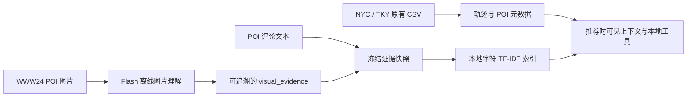
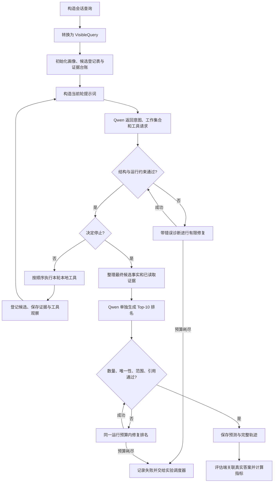

# IAAA 当前自主 Agent 的完整工作流程

核对日期：2026-09-21。本文说明当前已经实现的 `autonomous` 引擎（实验中的 D 组），并说明它与固定流程、实验调度器之间的关系。

初稿核对依据是本地源码、109 服务器的冻结协议和真实会话日志。初稿对应 `autonomous_v1_20260918_fix01`，协议 SHA256 为 `796d5a3649e5e2d0df54165c2482f103f230c07da1ef3f3b326cfa9298e79bef`，当时 20 个协议内代码文件均一致。

2026-09-21 增补：后继版本 `autonomous_v1_20260921_fix02` 进一步将停止标志与工具数量绑定到生成 Schema，防止 `stop=false` 却没有工具的无动作决策。下文已补充这一约束；第 14 节仍明确保留 fix01 的真实历史案例，不将其归入新版结果。新版本协议和验证状态以其 `RUN_RECORD.md` 为准。

同日 fix03 增补：NYC 开发会话出现重复工作候选耗尽修复预算。实测当前 xgrammar 0.2.3 忽略数组 `uniqueItems`；C/D 决策改用 ID 为键、值为 `true` 的候选集合对象，由动态 Schema 限制可选键及数量，并在原始 JSON 解析时拒绝重复键。内部状态仍保存 ID 列表，最终排名接口不变。fix03 单独冻结、重新生成正式阶段预测，不混用旧版结果。

**当前系统由一个 Qwen 模型负责多轮决策：根据可见轨迹提出意图假设，自主选择本地检索与证据工具，调整候选集合，决定何时停止查找，再单独生成 Top-10 推荐。** 程序负责执行工具、保存状态、限制预算、校验输出和计算评估指标。

本文描述实现机制，不把开发阶段的个别成功案例当作推荐效果或全量稳定性结论。

## 1. 先明确这里的“自主”指什么

任务仍是 next-POI prediction：给定用户过去的签到、当前会话中已经发生的签到和待预测时刻，预测下一次签到的 POI。

当前入口接收 `user_id` 和 `trajectory_id`。它还不是面向终端用户、可以自由聊天并接受任意自然语言需求的旅行助手；当前意图主要由模型从轨迹和证据中推断。

| 决定 | 当前由谁负责 | 具体内容 |
|---|---|---|
| 可用数据和任务边界 | 程序 | 哪些签到可见，哪些字段属于答案，使用哪个冻结证据快照 |
| 意图假设 | 模型 | 此刻可能想做什么、相关类别、还存在哪些不确定性 |
| 工具选择 | 模型 | 先查历史、空间、转移，还是先搜索或阅读外部证据 |
| 工具参数 | 模型，程序校验 | 类别、半径、查询词、分页位置、要检查的 POI |
| 工作候选集合 | 模型，程序校验 | 保留哪些候选、替换哪些候选、何时找回之前的候选 |
| 提前停止 | 模型，程序校验 | 在候选数量合格、预算允许时判断是否还需要查找 |
| 强制收尾 | 程序 | 到最后一轮或工具预算耗尽时，要求停止调用工具 |
| 最终顺序和解释 | 模型 | 对最终集合排序，给出 affordance 判断和引用 |
| 唯一性、引用合法性、成本与评估 | 程序 | 拒绝重复或越界输出，记录请求，再与真实答案对比 |

因此，当前实现是**有工具白名单和明确预算的单 Agent 决策循环**。决策阶段与排名阶段使用同一个模型的不同提示词，没有多个角色 Agent 相互协商。

实现上，模型返回结构化 JSON，其中包含 `tools` 列表，再由 Python 分派执行。这里没有依赖模型 API 原生的 `tool_calls` 协议，也没有让模型直接执行代码。

## 2. 两条链路：离线准备与推荐时决策

### 2.1 离线准备多模态证据

图片首先经 Qwen3.8-Flash 处理。一个 POI 可以有多张图片，预处理结果保留该 POI 的图片观察和来源信息。随后，将图片观察与评论整理成按 POI 组织的冻结证据快照。



当前推荐 Agent 读取的是**图片转成的文字证据**。它不会在每次推荐时上传原图，也不会临时调用 Flash。当前推荐模型为服务器上的 `Qwen/Qwen3.8-27B-FP8`，通过本地 vLLM 接口 `http://127.0.0.1:8000/v1` 调用。

多模态证据的使用规则如下：

- 图片索引使用 `visual_evidence`，不把推测性的 `possible_activities` 当成已观察到的事实。
- 评论视为访客报告；图片文字视为模型观察。二者的实际观察日期可能未知。
- 没有图片摘要的 POI 仍可被轨迹工具召回，也可以保留评论证据。
- 快照校验覆盖城市、内容哈希和来源 CSV 哈希；数据不匹配时拒绝继续。
- “完整快照”是处理状态符合快照规则，不等于每个 POI 都有图片和评论。

### 2.2 推荐时的总体流程



图中的“修复”需要重新请求模型。程序不会把错误输出静默去重后补齐候选。

## 3. 输入是什么，模型能看见什么

### 3.1 从会话构造查询

`NYCDataRepository.get_session_query()` 将会话最后一条签到作为预测目标：

```text
context = 当前会话中目标之前的签到
target  = 当前会话最后一条签到
history = 用户按时间排序后、划分点之前的长期历史
```

工具使用的用户可见访问记录，是 `history` 与 `context` 合并去重后的结果。当前会话较长时，额外的可见记录可以通过 `get_history` 分页读取。

进入 C/D 引擎前，`VisibleQuery.from_query()` 只保留用户和会话标识、目标时间、可见历史及上下文；不把目标 POI ID、目标类别或目标经纬度传给决策工具。

### 3.2 首轮实际提供的信息

| 内容 | 作用 |
|---|---|
| 目标本地时间、星期 | 推断待预测时刻的活动背景 |
| 最后一次可见签到的位置 | 计算候选距离和空间检索范围 |
| 距上次签到的时间间隔 | 判断移动背景 |
| 当前会话最近最多 5 条签到 | 提供近期行为序列 |
| 历史访问次数、常去 POI、常见类别 | 概括长期偏好 |
| 小时和星期分布、回访比例 | 提供时间习惯与重复访问倾向 |
| 移动距离中位数和 75% 分位数 | 提供历史移动尺度 |
| 常见类别转移 | 帮助推断下一类活动 |
| 外部证据是否可用 | 告知可否使用评论、图片文字工具 |
| 时间戳并列标记与证据使用规则 | 明确顺序和知识边界 |

初始 `intention` 是空值，由第一次模型决策产生；D 组没有先运行一次旧固定流程的意图模块。

### 3.3 时间与候选目录边界

用户长期历史必须严格早于目标时间。当前会话上下文不得晚于目标时间；原数据中存在与目标时间戳相同的事件时，保留预定义会话顺序并记录标记。对应全量报告另做排除这些会话的敏感性分析。

POI 目录使用全数据已知的 ID、类别和坐标，因此未被该用户访问过的 POI 也可成为候选。这属于已知地点目录的 transductive 设置。访问频次、转移等统计使用当前历史划分及允许的上下文。

全局历史按**各用户自己的时间序列比例**划分，不是所有用户共用同一个日历截止时刻；不能将其描述为严格按全局时间回放的在线系统。

## 4. Agent 在一个会话里维护哪些状态

| 状态 | 含义 | 如何更新 |
|---|---|---|
| `intention` | 当前活动目标、类别假设和不确定性 | 每轮模型可重新给出 |
| `registry` | 已经登记的候选总表 | 召回、证据搜索、允许的候选检查逐步增加 |
| `working` | 当前重点比较的候选集合 | 每轮由模型的 `working_poi_selection` 整体替换，内部存成 `working_poi_ids` 列表 |
| `references` | 结构化事实和外部证据引用台账 | 登记候选、阅读证据时积累 |
| `evidence_refs` | 每个 POI 已读取的外部证据引用 | `read_evidence` 后积累 |
| `latest_observations` | 上一轮工具的结果或错误 | 每轮替换，传给下一次决策 |
| `trace` | 所有轮次的决策、工具和候选变更 | 每轮追加并写盘 |
| `tool_count` | 已消耗的工具调用预算 | 每个工具请求都计数 |
| 请求日志 | 请求、响应、修复、用量与身份 | 每次请求前后写盘 |

### 4.1 候选总表与工作集合是两回事

例如，工具累计找到了 120 个不同地点，模型可以只保留其中 30 个进行重点比较。120 个都仍在 `registry`，30 个位于 `working`。

从工作集合移除某个 POI 不会从登记表中删除它。模型之后可以通过 `list_candidates` 查看，再在下一轮把它选回工作集合。

当前 60 个的上限约束的是工作集合和最终排名输入，不是整个已发现候选总表。总表可以超过 60。

当登记表已有至少 10 个候选时，模型每轮都必须保留至少 10 个不同的工作候选。这个约束避免中途只剩几个候选，最后却被要求输出 Top-10。

### 4.2 模型不会每轮看到完整历史对话

每轮请求重新组织当前状态，主要包含固定可见上下文、当前意图、工作候选事实、上一轮工具观察和剩余预算。所有过去轮次都保存在 `trace`，但不会全部拼进每轮提示词。

因此，跨轮持续保留的信息主要通过意图、工作集合、登记表和证据台账承载。最终排名会重新取出最终候选已读取的证据。当前没有跨用户、跨会话持续学习的长期记忆；请求缓存用于恢复和审计，不是模型训练。

## 5. 一轮自主决策内部如何执行

### 5.1 先判断是否必须收尾

默认最多 6 轮决策。前 5 轮允许调用工具，第 6 轮只能整理候选并停止。如果在更早轮次已经用满 12 次工具调用，下一轮也进入只整理候选的模式。

收尾时若登记候选仍不足 10 个，运行直接失败。系统不会从真实答案或任意目录中补足候选。

### 5.2 组织模型输入

每轮输入包含：

```text
visible_context       可见背景、最近签到、用户画像
intention             上一轮意图假设
working_candidates    当前工作集合的结构化事实表
latest_observations   上一轮各工具的结果或错误
registry_count        已登记候选总数
budget                当前轮次、剩余工具次数、是否只能收尾、Top-K
```

工具返回的候选卡片会压成“列名 + 数据行”以节省输入；已有检查结果的字段不会为了表格化而丢失。

### 5.3 模型输出决策 JSON

下面仅示范首轮合法结构，POI 和意图是说明用示例：

```json
{
  "intention": {
    "goal": "Find a plausible nearby food stop after the recent visits.",
    "categories": ["Food & Drink Shop"],
    "uncertainty": ["A familiar destination or a new nearby venue may both fit."]
  },
  "working_poi_selection": {},
  "tools": [
    {
      "name": "recall_pois",
      "args": {"source": "historical", "limit": 20}
    },
    {
      "name": "recall_pois",
      "args": {"source": "spatial", "radius_km": 5, "limit": 20}
    }
  ],
  "stop": false,
  "reason": "Compare familiar visits with nearby alternatives before selecting candidates."
}
```

`reason` 是简短的动作解释。`working_poi_selection` 是整份新工作集合，不是只填本轮增加的 ID。例如 `{"P000001":true,"P000003":true}` 表示模型选择这两个已经登记的 POI；未选 ID 省略，键按 ID 升序输出。这里的顺序不表示推荐名次，最终排名另有独立步骤。首轮没有登记候选时只能填写空对象。

程序会针对当前登记表动态生成 JSON Schema，将每个允许 ID 声明为可选键，禁止额外键，限制键数量和仅允许 `true` 的值。服务器实际解码器已验证能阻止重复键、未知 ID、少于下限或超过上限的集合，覆盖空登记表、40 和 600 个候选。接收端在标准 JSON 解析可能覆盖重复键之前独立拒绝重复键，再将合法选择转为内部 ID 列表，并用 Pydantic 与额外校验检查越界、工具预算和停止条件。程序不会去重后接受错误结果，不增选候选，也不补齐排名。

fix02 将自主决策的 Schema 写成两个互斥的完整分支：`stop=false` 对应 1 到剩余允许数量的工具，`stop=true` 对应空工具列表，且 `stop`、`tools`、工作集合等字段必须显式返回。候选不足时仅保留继续分支，强制收尾时仅保留停止分支。这是把原有校验规则提前到约束生成阶段，不增加修复预算，也不自动改写模型的停止决定。

### 5.4 先更新工作集合，再执行工具

本轮决策中的工作集合必须来自**本轮调用工具之前**已经登记的候选。首轮通常为空；首轮工具找回的 POI，要到下一轮决策才能被纳入工作集合。

一轮最多可提出 3 个工具请求，程序按列表顺序执行，再将结果一起送入下一轮。模型不会在同一轮的第一个工具执行后立即重新决策；反馈发生在轮次之间。

工具成功后，记录新增候选数、分页信息、证据或结构化事实。工具参数有误等可恢复错误会以 `tool_error` 反馈给下一轮模型，同时计入工具次数。

### 5.5 决定继续还是停止

正常提前停止要求 `stop=true`、`tools=[]`，且工作集合至少有 10 个不同候选。继续决策则必须提出至少一个工具请求。

模型可以认为证据已经充分而提前停止；也可以继续扩大范围、换召回来源、阅读证据或找回候选。程序不读取命中与否来决定是否让模型继续查找。

## 6. 工具白名单及其作用

当前对模型公开 6 个工具名，其中 `recall_pois` 有 6 种召回来源。

| 工具 | 用途 | 默认值与主要边界 | 是否增加候选 |
|---|---|---|---|
| `get_history` | 分页读取用户可见签到，最近的在前 | `offset=0, limit=20`；单页最多 50 | 不直接登记候选 |
| `recall_pois` | 按指定来源寻找地点 | 单次默认 20、最多 50；空间/类别半径 1–50 km | 是 |
| `search_evidence` | 用文字检索评论或图片观察，发现相关地点 | `mode=both/images/reviews`；默认半径 10 km；最多 50 个结果 | 是 |
| `read_evidence` | 阅读指定已知 POI 的证据片段 | 一次最多 5 个 POI；每种模态最多 1 条；每条最多 400 字符 | 不直接登记候选 |
| `inspect_candidates` | 获取候选的完整移动行为事实 | 一次最多 10 个；必须已登记或属于可见历史 | 可以登记已知历史 POI |
| `list_candidates` | 按发现顺序查看已有登记表 | 默认每页 20，最多 50 | 不新增 |

工具里的 `poi_ids` 使用 `P000001` 这样的紧凑编号。最终输出再由程序映射回原始 POI ID。

### 6.1 六路召回具体做什么

| `source` | 来源 | 当前检索依据 |
|---|---|---|
| `historical` | 用户可见历史 | 访问频次、相同星期、相同三小时时段、个人 POI 转移 |
| `spatial` | 已知 POI 目录 | 半径内按距离优先检索；可用可见历史 POI 作为锚点 |
| `category` | 已知 POI 目录 | 指定类别或同类别家族，半径过滤后结合历史目录频次与距离排序 |
| `transition` | 个人与全局历史 | 从最后可见地点出发的个人/全局 POI 转移，以及类别转移关联地点 |
| `peer` | 相似用户的历史 | 用类别偏好与空间重合挑选相似用户，统计相近时间习惯下的访问地点 |
| `temporal` | 全局历史 | 相同星期、相同三小时时段出现的地点 |

这些工具复用了原工程中已存在的统计组件。源内排序仍有固定公式，例如历史召回使用频次与时间、转移计数；自主性体现在模型选择调用哪些来源及如何使用返回结果。

D 组不会把多个来源的分数重新归一化后加总成固定推荐分数，也没有强行保留若干多模态候选的配额。距离半径主要用于空间、类别和证据检索，不应理解为所有六种召回都执行相同半径过滤。

### 6.2 `inspect_candidates` 返回哪些事实

包括类别、距最后可见位置的距离、个人访问次数、相同时段和星期的访问次数、个人/全局 POI 转移次数、全局目标时段访问次数、目录可见访问次数、是否有图片或评论，以及事实引用编号。

这些是供模型判断的事实特征。比如“过去在相同时段来过”不等价于“当前正在营业”，“距离近”也不等价于“存在可用交通路线”。

### 6.3 工具缓存

同一会话内，工具名和参数完全相同的请求直接复用已计算结果，并标记 `cached=true`、`new_candidate_count=0`。

重复调用即使命中缓存，也会消耗一次工具预算。这样模型反复请求同一个结果不会获得无限决策机会。目前程序没有单独根据“无新增候选”强制提前停止，主要依赖模型判断与总预算。

## 7. 图片和评论究竟在哪一步起作用

### 7.1 搜索：帮助发现候选

`search_evidence` 使用字符 3–5 gram 的 TF-IDF 检索。它对证据文字建立索引，并根据模型给出的查询词计算词面相关性。

一个 POI 的检索相关性取其可用片段中的最大匹配值；通过相关性阈值后，再做半径过滤和距离折减，返回地点卡片并登记候选。它不是视觉向量或语义 embedding 检索，英文查询与日文证据之间也没有自动翻译保障。

**搜索结果中的相关性用于排序检索结果，不是用户下一次到访该 POI 的概率。**

### 7.2 阅读：把片段放进可引用证据台账

`search_evidence` 返回候选与相关性，不等于模型已经读过证据正文。模型需要进一步调用 `read_evidence`，才能获得相关片段和 `E00001` 这样的外部引用。

读取时可指定查询词，使每种模态优先选出相关片段；返回图片/评论类型、文字、日期信息、截断标记和缺失模态列表。

两类主要引用是：

| 引用示例 | 内容 | 支持范围 |
|---|---|---|
| `F003606` | 某 POI 的结构化移动事实 | 类别、距离、访问与转移统计 |
| `E00001` | 某 POI 的外部证据片段 | 指定图片观察或评论报告中的内容 |

每条外部引用记录原始证据 ID、快照 ID、所属 POI 和模态，便于回溯。

### 7.3 决策与排名：使用已经读到的信息

读到的片段可以影响下一轮意图和候选保留；最终排名器还会收集最终候选在此前已经读过的证据。

每个最终候选最多放入每种模态各一条已读取证据，当前实现按台账顺序取该模态首先出现的引用；不是对全部已读片段重新做最优选择。排名前每条文字先裁到最多 40 tokens，随后还可能按总输入预算继续压缩。

### 7.4 `both` 表示允许使用证据，不保证每次都使用

`autonomous__both` 为模型提供证据工具，但不强制它搜索图片、阅读评论或引用外部证据。它可能只根据轨迹完成整个推荐，也可能只用外部搜索增加候选、没有继续读正文。

因此，分析多模态是否被实际利用，需要分别检查：

1. 是否调用 `search_evidence`，新增了哪些候选。
2. 是否调用 `read_evidence`，读到了什么。
3. 最终 Top-10 是否引用图片或评论片段。
4. 推荐结果、候选覆盖和成本是否随这些行为变化。

轨迹模式下外部证据不可用。若模型仍请求证据工具，会收到工具错误，不能读取快照。

## 8. 最终排名与 intention–affordance 输出

停止检索后，系统额外调用一次公共 LLM 排名器。它看到可见上下文、最终意图、最终工作候选的完整事实表，以及这些候选已读取的外部片段。

候选展示顺序用会话 ID、POI ID 和固定字符串的哈希决定，避免直接把召回顺序当作排名提示。模型只能从最终工作集合中选出 10 个不同 POI。

每个结果含五种核心 affordance 判断：

| 维度 | 判断问题 |
|---|---|
| `category` | 地点类别是否符合推断的活动目标 |
| `spatial` | 位置与可见移动背景是否相容 |
| `temporal` | 历史时间行为是否支持此刻访问 |
| `revisit` | 个人过去访问该地点的习惯是否支持回访 |
| `transition` | 从当前可见地点或类别转移到这里是否有依据 |

各维度使用 `yes / no / uncertain / not_available`，同时给出简短理由、1–8 个引用、缺失证据和冲突。当前没有把这五项重新加权生成数值 `alignment_score`，最终顺序直接由模型给出。

程序验证结果恰好 10 条、ID 唯一、来自允许集合，且每个引用确实出现在排名输入中并属于同一个 POI。随后补上原始 POI ID、类别、距离和名次。

**当前引用校验是结构与归属校验。** 它不能自动证明一段文字在语义上充分支持模型解释，也不能证明 affordance 判断正确；这部分仍需案例审计。

## 9. 默认预算，以及“每个会话”的准确含义

| 项目 | 当前默认值 |
|---|---|
| 模型决策轮数 | 最多 6 |
| 可调用工具的决策轮 | 最多前 5 轮 |
| 每轮工具数 | 最多 3 |
| 单次 Agent 运行工具总数 | 最多 12，缓存命中和工具错误也计数 |
| 工作集合 | 登记足够候选后为 10–60 个不同 POI |
| 最终输出 | 10 个不同 POI |
| 结构化请求输入上限 | 11,500 tokens |
| 决策输出上限 | 2,048 tokens |
| 最终排名输出上限 | 4,096 tokens |
| 模型上下文上限 | 16,384 tokens |
| 模型额外修复/重试 | 同一次 Agent 运行合计最多 2 次 |
| 单次 HTTP 请求超时 | 最多 180 秒，同时受剩余运行时间约束 |
| 单次 Agent 运行时限 | 1,200 秒 |
| 采样设置 | temperature=0，seed=42，thinking 关闭 |

对于 C/D，一次完整运行通常最多 6 个决策请求 + 1 个排名请求；包括 2 次额外修复，最多 9 次物理模型请求。提前停止会减少请求数。

这里“一次 Agent 运行”指一个会话下的一个实验组，例如 `autonomous__both`。开发/验证中的一个配对会话要依次跑 A/B/C/D × 两种输入，总共 8 组，因此并不是整个八组会话共享 1,200 秒或两次修复预算。

输入长度使用同模型 tokenizer 的 chat template 实际计数。常规提示词在 11,500 内再为修复反馈预留最多 1,024 tokens；超长时逐步缩短证据文字，保留候选 ID 与必要事实。仍装不下时显式报 `context_budget_exceeded`。

运行时限在当前运行对象创建时开始计时，并在循环和请求派发处检查。重启恢复会重新创建对象；它不是跨所有重启累计的严格 20 分钟总时钟。固定随机种子也不能被当作服务端完全可复现的保证，所以验证阶段另有重复运行检查。

## 10. 遇到错误如何处理

### 10.1 决策或排名输出不合法

重复 POI、引用错误、候选越界、停止时不足 10 个、继续却没有工具、响应截断或缺少 usage 等，都会使该次模型输出不被接受。

修复请求会尽可能带上上一版错误 JSON，并附具体诊断。例如指出某 ID 在第几个位置重复、列表实际有多少个不同 POI。若完整错误答案放不下，则缩为 ID/引用摘要；必要时仅保留诊断，原始事实继续保留。

所有决策和最终排名共同使用该运行的两次额外修复预算。不能每轮各重试两次，也不会用启发式排名兜底掩盖失败。

### 10.2 工具请求有误

参数范围错误、访问未观察过的 POI、在无证据模式读图片等可恢复工具错误，会写入观察，模型可以下一轮改变行动。

工具错误和模型 JSON 校验错误是两种机制：前者一般推进到下一决策轮，消耗工具/轮次预算；后者在同一逻辑请求中使用模型修复预算。

### 10.3 实验中的会话失败

若某一组耗尽修复预算或遇到不可恢复错误，该会话记录为 `failed`，保留先前已完成的组、请求日志、错误和 traceback。其余已提交会话继续执行。

每批最多按并发数提交会话；一批结束后，累计失败会话达到 4 个则停止提交后续批次。即使只有 1 个失败，阶段结束时的完整性质量门槛也不会通过，不能自动进入下一阶段并把部分成功数据当作正式完整配对结果。

## 11. 保存了什么，如何恢复

以某个开发会话为例：

```text
results/
  manifest.json
  progress.json
  cases/development/NYC/652__652_38.json
  runs/development/NYC/652__652_38/
    autonomous__both/
      calls/
        decision_01.json
        decision_02.json
        ...
        final_ranking.json
      state.json
      prediction.json
  summaries/
  REPORT.md
```

| 文件 | 主要用途 |
|---|---|
| `manifest.json` | 冻结代码、模型、数据、证据、tokenizer、样本与统计协议 |
| `calls/*.json` | 保存原始消息、请求选项、每次尝试、原始/解析输出、usage、错误与时间 |
| `state.json` | 保存轮次轨迹、工作集合、候选登记表和引用台账，便于查看过程 |
| `prediction.json` | 保存通过校验的最终推荐、解释、候选诊断、轨迹和成本 |
| `cases/*.json` | 聚合一个会话的各组结果，并在评估侧记录真实答案与指标所需字段 |
| `progress.json` | 当前阶段、完成/失败数、活跃会话和最近事件 |
| `summaries/`、`REPORT.md` | 阶段质量检查、指标、配对比较与成本报告 |

JSON 使用临时文件加原子替换写入。请求会在派发前先记为 `inflight_or_interrupted`，避免中断后把已发出的请求伪装成从未发生。

恢复时，程序先验证协议、消息、模型及请求选项身份。已接受的模型输出可从请求日志复用，再重放本地确定性工具来重建状态。`state.json` 主要用于查看和审计，当前恢复机制不是从任意中间 Python 对象直接续跑。

已存在的合格最终预测可直接复用。中断但未完成的尝试仍保留并影响请求/修复预算；缺失的 usage 不会被编造。代码、数据或协议改变后，正式实验应使用新的冻结目录，不能把新旧预测混合成同一版本结果。

## 12. 四个实验引擎分别用于回答什么

| 组别 | 引擎 | 流程 | 主要比较问题 |
|---|---|---|---|
| A | `fixed` | 原 P4v1 意图、候选组织、规则判断与排名 | 保留原系统参照 |
| B | `fixed_llm_rank` | 复用对应 A 的意图、扩展决定与最终候选，交给公共 LLM 排名器 | 相同前端候选下，更换排名方式有什么变化 |
| C | `fixed_schedule` | 使用新状态和公共排名器，程序固定工具顺序，模型填参数并选候选 | 提供与 D 接近的新框架固定调度对照 |
| D | `autonomous` | 模型选择工具、顺序、参数、候选和停止时机 | 自主调度带来什么变化 |

每个引擎有 `text` 和 `both` 两组。这里 `text` 指轨迹及结构化 POI 信息；`both` 才加入评论和图片文字证据。

B 的候选和意图与 A 对齐；在图文模式下，B 的排名输入还采用公共排名器的证据读取与组织方式。因此应将 A/B 理解为“相同前端下替换整套排名处理”，不要额外声称两者给排名模块的每个字节都相同。

C 的六轮安排是：

| 轮次 | 程序指定的工具顺序 |
|---|---|
| 1 | 历史召回 → 空间召回 |
| 2 | 转移召回 → 时段召回 |
| 3 | 类别召回 → 相似用户召回 |
| 4，图文 | 证据搜索 → 证据阅读 → 候选检查 |
| 4，轨迹 | 候选检查 |
| 5 | 空间扩展 → 类别扩展；固定半径 20 km、单路 limit=50 |
| 6 | 整理候选并停止 |

C 不能改工具顺序或提前停止，但仍由模型更新意图、填写允许的参数并选择工作集合。C/D 的预算上限相同，实际请求数、工具数和 token 成本可能不同，不能直接称为完全等算力实验。

## 13. 外层实验调度流程

当前冻结配置的执行顺序如下：

```text
校验代码、数据、模型与证据身份
  → NYC 开发集 50 会话，8 组
  → TKY 开发集 50 会话，8 组
  → NYC 独立验证 500 会话，8 组
  → TKY 独立验证 500 会话，8 组
  → NYC 自主组烟测 50 会话
  → NYC 自主组全量 3,976 会话
  → TKY 自主组烟测 50 会话
  → TKY 自主组全量 11,664 会话
```

每个阶段先通过运行质量检查再前进，不依据准确率是否提高来放行。每城验证集中的固定 100 个会话，额外重复运行 D 的 `text/both` 两组。

开发与独立验证的目标来自每用户 `[70%, 80%)` 区间，排除旧消融会话后按 ID 哈希选取，长期历史用前 70%；全量测试沿用旧实验的前 80% 历史和相同测试会话。

全量阶段主要新增 D 两组，并与已有 A 全量结果配对。NYC/TKY 的 50 会话烟测属于各自全量中的同一批会话，已完成预测通过缓存复用。已修复的 TKY 历史异常结果按来源和哈希验证后复用。

并发数为 4，表示同时处理最多 4 个会话。每个会话内部依次跑各实验组；两种模态的先后由不使用标签的稳定规则决定，A 总在需要它的 B 之前执行。

### 13.1 质量检查与推荐指标分开看

质量检查关心会话身份是否一致、组别是否齐全、是否都有合法 Top-10、是否有真实模型请求和完整 usage、是否发生预测兜底。

通过质量检查以后，再分析 Hit@1/5/10、NDCG@10、MRR@10、IH/OOH、候选召回、证据引用、工具使用、token 和耗时。95% 区间采用用户聚类 bootstrap 2,000 次；主要 Hit@10 比较采用用户成组置换 10,000 次及预定义比较族的 Holm 校正。

### 13.2 候选诊断如何定位损失

| 诊断 | 当前含义 |
|---|---|
| `RawCandidateRecall` | 真实 POI 是否进入工具实际返回并登记的候选总表 |
| `CandidateRecall` | 真实 POI 是否被保留到最终工作候选集合 |
| Hit@10 | 真实 POI 是否进入最终 Top-10 |
| `ObservedCandidateRecall` | 实现记录的观察候选覆盖，用于补充检查 |

`available=500` 只是某工具可分页访问的检索结果数量，不代表已经把 500 个地点全部召回给模型。当前 C/D 的 `observed_ids` 在候选登记时增加，因此它与 raw 集合通常相同，不能当成一个天然独立、严格更小的中间层。A 和历史基线的 observed 定义又有差别，报告中需按记录的定义解释。

这组诊断能区分“没检索到”“检索到了但被移出工作集合”“保留了但没排进 Top-10”。

## 14. 一个真实运行案例：652 / 652_38

以下来自 fix01 已经完成的 NYC 开发会话，组别为 `autonomous__both`。它用于说明该版本的实际行动路径，不用于评价多模态收益或代表后继版本的查询策略。

来源文件：

```text
/home/yzj/IAAA/outputs/experiments/autonomous_v1_20260918_fix01/results/runs/development/NYC/652__652_38/autonomous__both/prediction.json
```

该文件 SHA256：`be541de8253ab38a02fdcefa49956af01edd2aa00b9498ee7aa3f43631215497`。

| 轮次 | 模型给出的工作集合大小 | 实际行动 | 新增不同候选 |
|---|---:|---|---:|
| 1 | 0 | 历史召回 20；以可见历史地点为锚点、5 km 空间召回 20；10 km 类别召回 20 | 20 + 16 + 17 = 53 |
| 2 | 20 | 检查 10 个候选的移动事实 | 0 |
| 3 | 20 | 转移召回 20 | 19 |
| 4 | 20 | 再次检查同一批候选，命中工具缓存 | 0 |
| 5 | 20 | 再次执行相同转移召回，命中工具缓存 | 0 |
| 6 | 20 | 整理候选并停止 | 0 |

之后排名器从 20 个工作候选中输出 10 个不同 POI。整个流程登记了 72 个不同候选，调用工具 7 次；模型有 7 个逻辑请求，另用满 2 次修复，共 9 次物理请求，记录总用量 36,313 tokens，usage 无缺失。

这个案例有两个需要如实理解的现象：

- 虽然启用了 `both`，模型没有调用证据搜索或阅读工具，台账中外部引用数量为 0。因此不能说这个案例的排名已经使用了图片和评论。
- 模型两次重复调用已经执行过的工具，并最终在预算收尾阶段停止。因此“能自主调用工具”不等于“已经学会最高效的查询策略”。

模型在各轮维持了偏向 Bar / Food & Drink Shop 的意图假设。这是模型输出的假设，不是额外获取的真实用户需求。该案例不报告命中情况，也不用于挑选参数。

## 15. 如何查看运行现场

服务器环境为 Conda `iaaa`。fix03 实验 screen 为：

```bash
screen -r iaaa-autonomous-fix03-0921
```

按 `Ctrl-a` 后按 `1` 查看实时进度，按 `0` 查看 runner 日志，按 `d` 脱离 screen。进度窗口每 10 秒读取已保存状态，不执行推荐请求。

`Sessions: completed` 只在该会话所有要求的组执行完成后增加；中间应看 `active` 中的引擎、模态和 `decision_XX` / `final_ranking`。例如：

```text
autonomous__both:decision_03
```

表示该会话正在执行 D 的图文模式第 3 轮决策。`model_started` 是请求开始事件，`model_finished` 表示请求已返回并完成这次处理，不能仅凭事件名认定响应被接受；是否成功以请求日志的 `accepted` 为准。

也可以直接查看：

```bash
cat /home/yzj/IAAA/outputs/experiments/autonomous_v1_20260921_fix03/results/progress.json
tail -f /home/yzj/IAAA/outputs/experiments/autonomous_v1_20260921_fix03/runner.log
```

fix01 的进度显示曾以独立的 `ops/watch_autonomous.py` 补充；fix02 使用 `code/scripts/watch_autonomous.py`，但旧启动脚本误判窗口存在。fix03 启动脚本按实际窗口列表创建进度窗口；显示操作与运行核验记录在 RUN_RECORD.md。显示器不会修改评估状态或模型输出。

## 16. 单独运行一个会话

下面是额外调试运行的示例，会实际调用服务器模型；输出目录与正式配对结果分开。

```bash
source /home/yzj/miniconda3/etc/profile.d/conda.sh
conda activate iaaa
cd /home/yzj/IAAA/outputs/experiments/autonomous_v1_20260921_fix03/code

python -m iaa_agent run-agent \
  --user-id 652 \
  --trajectory-id 652_38 \
  --train-ratio 0.7 \
  --data-dir /home/yzj/IAAA/datasets/NYC \
  --engine autonomous \
  --evidence-snapshot /home/yzj/IAAA/outputs/experiments/mm_pipeline_20260914/evidence/NYC_53c3456f6380.json \
  --evidence-mode both \
  --tokenizer-path /home/yzj/Model/Qwen38-27B \
  --model Qwen/Qwen3.8-27B-FP8 \
  --base-url http://127.0.0.1:8000/v1 \
  --output-dir /home/yzj/IAAA/outputs/agent_runs_manual
```

去掉 `--evidence-snapshot` 即为轨迹模式。单次入口还允许 `images` 或 `reviews` 证据模式，但当前八组冻结实验使用的是 `text/both`，不要把临时单模态调试结果混入正式矩阵。

成功后，预测保存在 `652__652_38/both/autonomous/prediction.json`；单次命令的评估端另写 `evaluation.json`，在模型预测结束后才关联真实目标。

## 17. 读代码时从哪里开始

以下路径均相对于项目根目录 `D:\Academic\IAAA`；函数名用于直接定位。

| 文件 | 重点入口 | 负责的流程 |
|---|---|---|
| `iaa_agent/agent_types.py` | `VisibleQuery`、`AgentConfig`、`AgentDecision`、`AgentRanking` | 输入边界、预算与输出契约 |
| `iaa_agent/agent_tools.py` | `POIToolService`、`execute`、`recall`、`search`、`read_items` | 工具执行、候选与引用台账 |
| `iaa_agent/autonomous.py` | `AutonomousAgent.run`、`rank`、`validate_ranking` | 决策循环与公共排名器 |
| `iaa_agent/agent_runtime.py` | `PromptBudget`、`JournaledModel.call`、`repair_messages` | token 控制、请求日志、修复与恢复 |
| `iaa_agent/agent_evaluation.py` | `run_variant`、`prediction_row` | 四个引擎的统一入口及预测后的评估 |
| `iaa_agent/evidence.py` | `EvidenceStore` | 冻结快照、TF-IDF 检索与片段读取 |
| `iaa_agent/data.py` | `get_session_query`、`use_user_chronological_split` | 会话查询与历史划分 |
| `iaa_agent/cli.py` | `run_agent` | 单会话命令 |
| `scripts/evaluate_autonomous.py` | `Experiment.execute`、`stage`、`run_case` | 实验阶段、并发、缓存和质量检查 |
| `scripts/autonomous_eval_support.py` | `quality_errors`、`summarize`、`paired_contrast` | 指标与配对统计 |
| `scripts/watch_autonomous.py` | `render`、`main` | 只读实时进度显示 |

已有测试覆盖目标隔离、工具缓存、引用归属、候选恢复、固定调度、重复输出修复、输入预算和恢复身份校验。测试证明的是对应实现约束，并不能替代正式推荐质量评估。

## 18. 当前能力边界与后续分析重点

目前已实现的是有界自主工具调用、跨轮候选管理、证据台账、公共模型排名和可追溯实验。当前版本仍保留固定工具实现、固定预算和固定最终输出格式。

它尚未实现在线看图、语义向量检索、任意网页查询、跨会话学习、工具策略训练或自动事实核验。多轮过程中更新意图与补充证据承担了部分“反思”的作用，但 D 没有继续执行旧 P4v1 那套基于固定分数的反思阈值，也没有新增一个独立反思模型。

后续分析应先确认运行完整性，再沿“候选是否被发现 → 是否被保留 → 是否被排进前十”的路径定位效果，同时检查外部证据实际使用率、重复工具调用、提前停止与预算收尾的比例，以及额外成本。仅凭启用 `both` 或改成自主调用，还不能得出多模态有效或自主 Agent 优于固定流程的结论。
