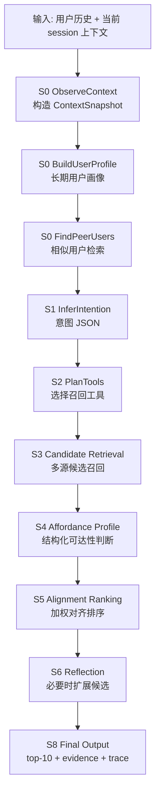

# IAA-Agent NYC-first 项目说明文档（P4v1 主线版）

## 1. 项目定位

本项目面向下一兴趣点推荐（next POI recommendation）任务，目标是在 Foursquare NYC 签到数据上实现一个可解释、可追踪、可评估的 Intention-Affordance Aligned Agent。与传统神经网络式 next-POI 模型不同，本项目不直接把用户历史编码为一个黑盒向量并输出 POI 排名，而是把一次推荐过程拆解为若干可检查的 agent 推理步骤：

```text
观察上下文 -> 推断意图 -> 规划工具 -> 召回候选
-> 构造 mobility affordance -> 对齐打分 -> 反思扩展 -> 排名与解释
```

项目当前版本是 **NYC-first / structured mobility affordance** 版本。它优先验证完整 agent 系统是否成立，而不是先追求 Agent4POI 式的多模态 item-side affordance。原因是当前 NYC 数据只包含用户、POI、类别、坐标、时间和轨迹信息，不包含评论、图片、真实营业时间、评分、价格或场景描述。因此，当前系统不会尝试生成这些不可观测信息，而是把它们统一记录为 `missing_evidence`，避免 LLM 幻觉补全。

一句话概括：本项目当前要证明的是，**在只有轨迹、类别、坐标和时间的 POI 数据上，能否构造一个具备完整 agent 流程、证据链和可解释 affordance 判断的 next-POI 推荐系统**。

## 2. 研究动机

传统 POI 推荐通常关注预测准确率，例如 Hit@K、MRR、NDCG，但预测过程往往不可解释。对于用户下一步位置推荐，单纯给出一个 POI ID 并不足以说明系统是否真正理解了用户的出行意图。我们希望系统能够回答以下问题：

- 用户当前可能想做什么活动？
- 为什么某个 POI 在空间上是可达的？
- 为什么某个类别在当前时间可能合理？
- 推荐是否来自用户自己的历史偏好，还是来自相似用户、全局热门、转移关系？
- 数据中缺少哪些证据，系统不能做哪些断言？

因此，本项目把 next-POI 推荐建模为一个 **意图识别 + 工具化召回 + affordance 对齐** 的过程。这里的 affordance 不是物理意义上的“可供性”，而是移动行为数据支持下的“访问可行性”和“意图匹配性”。例如，某个 POI 是否符合用户当前意图、是否在常见移动半径内、是否符合用户或群体在该时段的访问模式、是否符合从最近 POI 或类别出发的历史转移规律。

## 3. 数据与能力边界

当前使用 `datasets/NYC` 下的 Foursquare NYC 数据。系统按用户时间线进行切分：每个用户前 80% 的签到作为长期历史，后 20% 中的原始 `trajectory_id` session 用于测试。每个测试 session 只预测最后一次 check-in，session 中最后一次之前的 check-ins 作为短期上下文。

当前数据支持：

| 能力 | 是否支持 | 用途 |
|---|---:|---|
| POI 类别 | 支持 | 意图类别、类别匹配、类别转移 |
| POI 坐标 | 支持 | 距离、移动半径、空间可达性 |
| 时间戳 / 小时 / 星期 | 支持 | 时间适配、热门时间、session 切分 |
| 用户 ID | 支持 | 长期画像、重访倾向、相似用户 |
| 轨迹 ID | 支持 | session-level 测试、短期上下文 |
| 评论文本 | 不支持 | 进入 `missing_evidence` |
| 图片 | 不支持 | 进入 `missing_evidence` |
| 营业时间 | 不支持 | 进入 `missing_evidence` |
| 价格 / 评分 | 不支持 | 进入 `missing_evidence` |

这个边界对论文叙述非常重要：当前系统不是多模态 POI agent 的完整复现，而是一个在有限结构化移动数据上实现的 agentic recommender 原型。后续如果切换到 Yelp 等包含评论、评分和价格的数据集，才能进一步扩展 item-side affordance。

## 4. 总体系统流程

系统输入是一个测试 session，输出是 top-10 POI 排名、每个候选的 affordance profile、分数分解、证据、缺失证据和完整 agent trace。



### 4.1 上下文观察

`ContextSnapshot` 记录当前预测所能看到的信息，包括目标时间、星期、小时桶、最近的 POI 和类别序列、最后已知位置、距离上次签到的时间间隔以及短期移动摘要。关键约束是：上下文只能包含目标 check-in 之前的信息，不能泄漏 ground truth 或未来访问。

### 4.2 用户画像

`UserProfile` 用用户训练段历史和当前可见上下文构造。它包含：

- 高频 POI 与高频类别；
- 小时分布、星期分布、类别-小时分布；
- 重访率与探索率；
- 典型移动半径与 75 分位移动半径；
- 常见类别转移；
- 可供后续解释使用的 evidence summary。

画像既服务于意图推断，也服务于 affordance 计算。例如，用户过去是否常去某类 POI，会影响 `category_match`；用户移动半径会影响 `spatial_feasibility`；用户是否常重访会影响 `revisit_support`。

### 4.3 意图推断

当前系统支持两种意图模式：

- `fake`：确定性的启发式意图推断，不调用外部 API，用于单元测试、全量 baseline 和可复现实验。
- `deepseek`：调用 DeepSeek 生成结构化 intention JSON，用于真实 LLM 对照实验。

无论使用哪种模式，意图都必须落在统一结构上，包括 `activity_goal`、`likely_categories`、空间偏好、时间偏好、行为偏好、置信度和证据。DeepSeek 只负责生成结构化意图，不允许直接生成 POI 推荐，也不允许补全评论、图片、评分等数据中不存在的信息。

当前 P4v1 主线已明确 **不合并 P5 类别序列预测逻辑**。也就是说，LLM 不被降级为“类别序列预测工具”，而仍然作为结构化意图模块使用。

### 4.4 候选召回

候选池由多路工具召回并合并去重。当前召回源包括：

| 召回工具 | 作用 |
|---|---|
| `HistoricalRecall` | 用户历史 POI，高频访问、同星期、同小时桶和转移关系加权 |
| `SpatialRecall` | 距离最后已知位置最近的 POI |
| `CategoryIntentRecall` | 意图类别下的候选 POI |
| `TransitionRecall` | 从最近 POI 或类别出发的常见转移目标 |
| `PeerRecall` | 相似用户在目标时间附近访问过的 POI 或类别 |
| `TemporalPopularityRecall` | 稀疏用户场景下的全局时间热门补充 |

候选进入池后保留 source labels 和 source scores。这样最终推荐不仅有排名，还能说明“这个 POI 是被哪些工具召回的”。

### 4.5 Affordance 计算

每个候选 POI 会被转换为 `AffordanceProfile`。当前 affordance 维度包括：

| Affordance | 判断问题 |
|---|---|
| `category_match` | 候选类别是否支持当前意图？ |
| `spatial_feasibility` | 从最后位置到候选 POI 是否符合用户移动范围？ |
| `temporal_fit` | 用户或全局历史是否支持该 POI / 类别在目标时间访问？ |
| `revisit_support` | 用户是否访问过该 POI 或同类 POI？ |
| `transition_support` | 从最近 POI / 类别到候选是否有历史转移支持？ |
| `peer_support` | 相似用户是否在目标时间附近访问过该 POI / 类别？ |
| `popularity_support` | 该 POI 或类别在目标时段是否有全局热度？ |
| `reachability_time_gap` | 时间间隔与空间距离是否共同支持可达？ |

每个 affordance 的 verdict 只能是 `yes`、`no`、`uncertain` 或 `not_available`。缺失的评论、图片、营业时间、价格、评分等不会被推断，而是进入 `missing_evidence`。

### 4.6 排名与反思

系统对 affordance 进行加权求和，得到 alignment score。若出现候选不足、top 类别覆盖不足、top1/top2 分差过小、意图置信度低、类别熵过低或候选整体过远等情况，系统会触发最多一轮 reflection，扩大或补充召回范围后重新计算 affordance 和排序。

反思机制的作用不是让 LLM 自由发挥，而是让系统在可控条件下补充证据和候选，保持可解释、可复现、可审计。

## 5. P4v1 当前主线

当前 P4v1 指的是一个非常克制的单变量改动：**软化 `category_match` 中的类别不匹配惩罚**。

在原始逻辑中，如果候选 POI 的类别既不在意图 top categories 中，也不属于相同 category family，`category_match` 会返回 `no`，在最高权重维度上直接给候选 0 分。这在 next-POI 场景中可能过于强硬，因为用户存在探索行为，且当前 NYC 数据并没有“用户绝不会去某类别”的负证据。

P4v1 的处理是：当类别缺少意图支持时，不再判定为强否定，而是判定为低置信度 `uncertain`。这表示“类别证据弱”，而不是“类别明确不可能”。

当前代码中：

- 默认 `RunConfig()` 不启用 P4v1；
- `RunConfig.p4()` 才启用 `soft_category_mismatch=True`；
- `compare-p4` 用于比较 mainline 与 P4v1。

需要强调的是，当前 P4v1 **不包含** 以下仍处于研究开关状态的参数：

```python
source_quota = 0
multi_source_weight = 0.0
global_cat_transition_weight = 0.0
cat_intent_vc_weight = 1.0
cat_intent_dist_gain = 5.0
temporal_granularity = "bucket"
```

这些机制在代码中保留为实验扩展点，但尚未作为 P4v1 主线纳入。后续如果需要研究完整 P4，可以逐个单变量开启并比较，而不建议一次性全部开启。

## 6. 评估设计

项目当前使用 session-level evaluation。具体来说，对每个用户按时间排序，将前 80% 作为长期历史，后 20% 中满足条件的原始 trajectory session 用于评估。每个 session 的最后一次 check-in 是 ground truth，前面的 check-ins 是短期上下文。

当前支持三类评估：

| 评估类型 | 命令 | 用途 |
|---|---|---|
| 单元逻辑测试 | `python -m pytest -q` | 检查核心函数、无泄漏约束、trace 完整性 |
| 单用户评估 | `python -m iaa_agent evaluate --user-id 349` | 快速观察某个用户的所有 held-out sessions |
| 全量评估 | `python -m iaa_agent evaluate` | 用于正式指标报告 |
| 主线 vs P4v1 | `python -m iaa_agent compare-p4 --sample-fraction 0.5 --model deepseek-v4-flash --concurrency 4` | 真实 LLM 下比较 P4v1 是否带来增益 |

指标包括 Hit@1、Hit@5、Hit@10、NDCG@1、NDCG@5、NDCG@10 和 MRR。对于需要案例分析的实验，可以使用 `--save-runs` 保存每个 session 的完整 `AgentRunResult` JSON，其中包含 `agent_trace_summary`。

`compare-p4` 当前具备以下特性：

- 使用稳定哈希抽样，默认抽取 50% held-out sessions；
- mainline 与 P4v1 使用完全相同的 session 子集；
- DeepSeek 默认使用 `deepseek-v4-flash`；
- 支持 `--concurrency` 线程并发，减少真实 LLM 实验时间；
- 默认 strict LLM：如果某条 session 没有真实 token usage，会拒绝报告，避免静默回退 heuristic 造成假结果；
- 输出 JSON 中记录 sample keys、并发数、strict 设置、两组指标、token usage 和 delta。

## 7. 当前实现进度

当前已经完成：

- NYC 数据加载、用户时间线切分和 session-level evaluation；
- POI 原始 ID 到紧凑 `poi_idx` 的映射；
- 完整 agent workflow 与 JSON 输出；
- 多源候选召回；
- 结构化 mobility affordance 计算；
- reflection 与 top-10 排名输出；
- `missing_evidence` guardrail；
- fake LLM 与 DeepSeek structured intention 两种模式；
- DeepSeek token usage 记录；
- `evaluate --save-runs` 完整 trace 保存；
- `compare-p4` 主线 vs P4v1 的真实 LLM 抽样对比入口；
- fake 模式下的并行评估和 DeepSeek 对比中的线程并发；
- 项目文档整理到 `docs/`。

当前测试覆盖包括：

- 时间距离、haversine、session split；
- query context 不包含 target 和未来 check-in；
- recall trace 完整性；
- meta lookup 与逐个 `poi_meta` 等价；
- 分层报告整体口径与 baseline 一致；
- temporal granularity 开关默认不漂移；
- P4v1 只在显式 preset 下生效；
- 稳定抽样可复现；
- 进度回调和 threaded evaluator 行为。

## 8. 全量实验结果

| 指标 | 整体 | in_history (72.8%, n=2894) | OOH (27.2%, n=1082) |
|------|------|---------------------------|---------------------|
| Hit@1 | 0.2236 | — | — |
| **Hit@5** | **0.5199** | 0.6970 | 0.0462 |
| Hit@10 | 0.6006 | 0.7958 | 0.0786 |
| MRR | 0.3463 | — | — |


## 9. 未来发展

### 9.1 短期方向

- 跑完 50% DeepSeek mainline vs P4v1 对比，确认 P4v1 在真实 LLM 意图下是否仍然有效；
- 分析 P4v1 改善或伤害的具体 session，判断是否主要影响探索型访问、类别偏移访问或低置信度意图访问；
- 对完整 P4 旋钮做单变量真实 LLM 对照，而不是一次性全开；
- 增加实验结果 Markdown 报告，记录命令、时间、token usage、指标和案例。

### 9.2 中期方向

- 增加更细粒度的错误分析：候选未召回、候选进池但排序失败、意图类别错误、空间/时间证据冲突；
- 增强 trace 可读性，将每条 session 的工具调用、候选池变化和最终排名压缩成会议报告可展示的案例页；
- 研究是否需要把 `source_quota`、`multi_source_weight`、`global_cat_transition_weight` 等作为完整 P4 的实验分支，而不是主线默认行为；
- 增加论文对比表和消融实验表。

### 9.3 长期方向

当前留空，建议在确定论文主叙事后补充：

- Yelp fork / richer affordance 版本：待填写；
- 评论、评分、价格、营业时间等 item-side evidence 的 affordance 设计：待填写；
- 与 Agent4POI / IntentPOI / GETNext / ROTAN 等方法的正式对比：待填写；
- 是否引入 Web UI 或可视化 trace viewer：待填写；
- 是否引入学习型 reranker：待填写。

## 10. 当前版本的核心贡献表述

当前 P4v1 主线可以在会议报告中表述为：

> 我们提出了一个面向 next-POI 推荐的 Intention-Affordance Aligned Agent。该系统在仅包含轨迹、类别、坐标和时间的 Foursquare NYC 数据上，将推荐过程拆解为意图推断、工具化候选召回、结构化 mobility affordance 判断、证据对齐排序和反思扩展。与黑盒式排序模型相比，该系统输出的不仅是 POI 排名，还包括每个候选的支持证据、缺失证据、工具来源和完整推理轨迹。当前 P4v1 版本进一步修正了类别意图过度惩罚问题，将类别不匹配从强否定调整为弱不确定，以更符合用户探索行为和数据证据边界。

这个表述的重点不是宣称模型已经达到最终最佳性能，而是强调三个贡献：

- 完整 agent workflow；
- 结构化、可审计的 mobility affordance；
- 数据边界诚实与缺失证据 guardrail。
